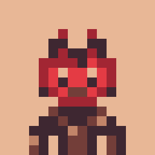

## <h1 align="center"> Hi  , I'm [ＡＲＴＡ](https://ArtaAbedi.com) </h1>

<h3><picture></picture><b>A Summary Of Work And Interest</b></h3>

 

 

 

  

       

  
  

<h3><picture></picture><b> About Me</b></h3>

  
  

 

 

       

 

<h3><picture></picture><b>Contact With Me</b></h3>

       

 

 
 

<h3>Donate 🤑💸</h3>

       

<h3><picture></picture><b>Social Media</b></h3>

 

 

# Find me on Discord 💻

       

 

<h3><picture></picture><b>Playlist</b></h3>

       

  

  
 

<h3><picture></picture><b>Now Play</b></h3>

       

 

 

<h3><picture></picture><b>Recently Played</b></h3>

  

       

  

  
 

<h3><picture></picture><b>Game Luncher's</b></h3>

       

 

<h3> <b>  Skills</b></h3>

       

<h3><picture></picture><b>WorkSpace</b></h3>

       

<h3><picture></picture><b>View Counter</b></h3>

       

<h3><b> Github Stats </b></h3>

<!--- stats & Trophy (start) -->

  
<!--- stats (start) -->

 

    
   

<h3><picture></picture><b>Game</b></h3>

      
   

<h3><picture></picture><b>Parrots Dance</b></h3>

    
    
    
    
    
    
    
    
    
    
    
    
    
    
    
    
    
    
    
    
    
    
    
    

       

 

<h3><picture></picture><b>Random Joke</b></h3>

 

       

